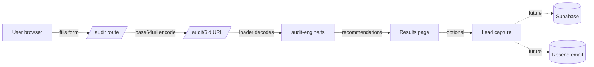

# Architecture

## System diagram

## Data flow

1. **Input** → `/audit` collects tool subscriptions via React state + Zod.
   Persisted to `localStorage` (`credex.audit.input.v1`) for back-button safety.
2. **Encode** → On submit, `AuditInput` is `JSON.stringify`'d and
   base64url-encoded into a URL-safe token.
3. **Loader** → `/audit/$id` loader decodes the token and runs `runAudit()`
   synchronously. No database hit, no network round-trip.
4. **Render** → Results page animates counters and renders recommendation
   cards sorted by `monthlySavings` desc.
5. **Share** → The URL itself is the shareable artifact. Copy/paste works
   from any device.

## Tech stack reasoning

| Choice               | Why                                                                                 |
| -------------------- | ----------------------------------------------------------------------------------- |
| TanStack Start       | First-class file routing, SSR-ready, edge-deploy. Same model as Next.js App Router. |
| Rules engine in TS   | Deterministic, testable, no API key needed at runtime, no hallucination risk.       |
| URL-encoded state    | Shareable reports without a DB. Trivial to swap for a Supabase `audits` row later.  |
| Tailwind v4 + tokens | Brand cohesion via `--gradient-savings`, `--shadow-glow`, etc. Zero ad-hoc colors.  |
| Zod                  | Single source of truth for input shape (form + server fn later).                    |

## Scalability

- **Stateless reads.** Every audit is computed from the URL. Edge cache can
  serve `/audit/$id` indefinitely. CDN-friendly.
- **Pricing data versioned in code.** When a vendor changes pricing, bump
  `pricing-data.ts` and ship — old shared links re-compute against new prices.
  If we ever need historical fidelity, encode the pricing-data version inside
  the share token.
- **Engine ~O(n × rules).** For typical n ≤ 8 tools, runtime is microseconds.
  Adding 100 rules still runs in <1ms.
- **Future DB layer.** Schema:
  - `audits(id, created_at, audit_data jsonb, recommendations jsonb, monthly_savings, yearly_savings, summary)`
  - `leads(id, email, company, role, audit_id, created_at)`
    Both indexed on `created_at`. Audits are immutable.

## Security

- No PII in the URL (only tool spend numbers — already public-ish).
- Email is validated on the client and would be re-validated server-side
  via a `createServerFn` once a backend is wired.
- No third-party scripts. No analytics by default.

## Future extensions

- Anthropic-powered summary as **augmentation** of (not replacement for) the
  template summary. Same prompt structure documented in `PROMPTS.md`.
- Vendor contract upload → parse seat counts automatically (PDF → spend).
- Slack/email digest: weekly re-audit and ping if savings change > 10%.
