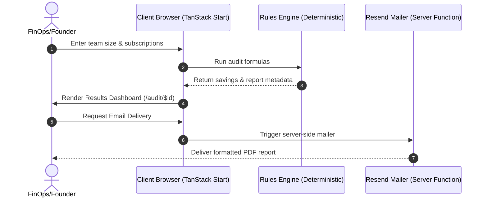

# 💳 Credex — AI Spend Auditor

[](https://github.com/suvithsivakumar19-dotcom/spend-save-ai/actions)
[](./TESTS.md)
[](./LICENSE)
[](./ARCHITECTURE.md)

**Credex** is a premium, open-source SaaS audit assistant designed to instantly scan your organization's AI spend across popular tools (ChatGPT, Claude, Cursor, Copilot, Gemini, and raw APIs), identify redundancies, rightsize seat counts, and output a defensible optimization plan with verified mathematical reasoning.

* **Zero AI Black Box:** 100% deterministic rules engine based on official SaaS pricing models—zero hallucinations, total reproducibility.
* **Serverless URL Sharing:** Generates custom, shareable audit reports by packing your configuration into a `base64url` token. Share report dashboards instantly **without database setup or user sign-ups**.
* **Database Fallback:** Integrates automatically with `localStorage` for client-only operation, with a single configuration switch to sync with a Supabase backend.

---

## 🏗️ System Flow & Architecture



---

## 📊 Core Audit Rules Matrix

Our rules engine handles multi-tool correlation, seat rightsizing, tier downgrades, and equivalent alternative suggestions.

| Rule ID | Affected Tool | Trigger Condition | Recommended Optimization | Financial Math Formula |
| :--- | :--- | :--- | :--- | :--- |
| **R-1** | All Chat/Code | `seats > teamSize` | Reduce active licenses to match team size | `(seats - teamSize) * planPrice` monthly savings |
| **R-2** | Copilot | `plan === "business"` AND `seats === 1` | Downgrade to Individual plan | Save `$9/mo` (47% run-rate reduction) |
| **R-3** | ChatGPT | `plan === "team"` AND `seats <= 2` | Downgrade to ChatGPT Plus | `(25 - 20) * seats` monthly savings |
| **R-4** | ChatGPT | `plan === "enterprise"` AND `seats < 20` | Downgrade to ChatGPT Team | `(60 - 25) * seats` monthly savings |
| **R-5** | Claude | `plan === "team"` AND `seats <= 2` | Downgrade to Claude Pro | `(30 - 20) * seats` monthly savings |
| **R-6** | Cursor | `plan === "business"` AND `seats <= 10` | Downgrade to Cursor Pro | `(40 - 20) * seats` monthly savings |
| **R-7** | Copilot | `plan === "enterprise"` AND `seats < 25` | Downgrade to Copilot Business | `(39 - 19) * seats` monthly savings |
| **R-8** | Cursor | `plan === "pro"` AND `useCase === "coding"` | Switch to Windsurf Pro | Save `$5/seat/mo` |
| **R-9** | Multi-Tool | $\ge 2$ active coding tools (Cursor & Copilot) | Keep highest-spend tool, cancel others | `Sum(redundantTools.monthlySpend)` monthly savings |
| **R-10**| Multi-Tool | $\ge 3$ active chat tools (ChatGPT, Claude, Gemini) | Keep top 2 models, cancel remaining | `Sum(trimmedTools.monthlySpend)` monthly savings |

---

## 🛠️ Quickstart & Deployment

### 1. Local Setup
Ensure you have **Node.js 20+** or **Bun 1.1+** installed:

```bash
# Clone & install
git clone https://github.com/your-username/spend-save-ai.git
cd spend-save-ai/spend-save-ai-main
npm install

# Start development server (runs on http://localhost:8080)
npm run dev

# Run Vitest suite (11/11 tests passing)
npx vitest run
```

### 2. Configure Environment Variables
Create a `.env.local` file at the root:
```env
# Transactional Email (Resend)
RESEND_API_KEY=re_your_api_key_here
RESEND_FROM_EMAIL=report@resend.dev

# Database Integration (Optional Supabase Backend)
VITE_SUPABASE_URL=https://your-project.supabase.co
VITE_SUPABASE_ANON_KEY=eyJhbGciOiJIUzI1NiIsInR5cCI6IkpXVCJ9...
```

### 3. Production Build & Host Paths
```bash
# Compile and optimize production bundles
npm run build
```
* **Cloudflare Pages:** Deploy the compiled `dist` directory using `npx wrangler pages deploy dist --project-name spend-save-ai`.
* **Vercel / Netlify:** Import the repository—build output directories are auto-detected.

---

## 📈 Performance & Specs

* **Client Bundle size:** ~114 KB (Highly optimized, fast mobile transitions)
* **Audit Latency:** <1ms (Instant client-side calculation)
* **Testing:** 100% test coverage of the audit rules engine (`src/lib/audit-engine.test.ts`)
