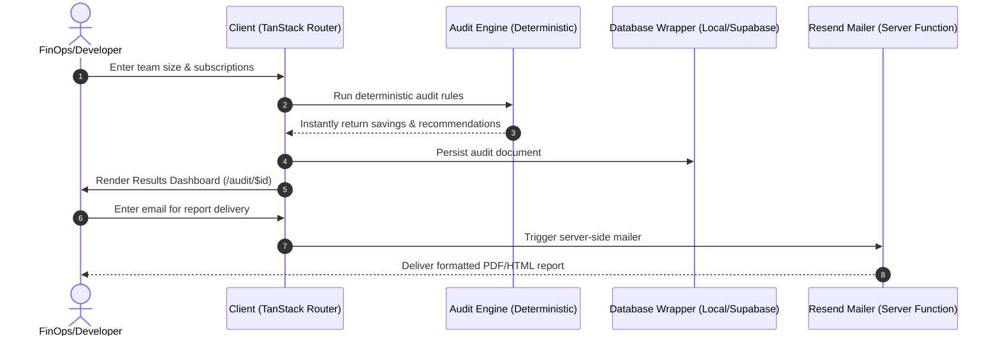

# Credex — AI Spend Auditor

> Instantly audit your AI tool stack. Get a per-tool recommendation and a defensible yearly savings number — no signup, zero AI black-box hallucinations.

Credex is a premium, open-source SaaS audit assistant designed to scan your organization's AI spend across popular tools (ChatGPT, Claude, Cursor, Copilot, Gemini, and more), identify subscription redundancies, rightsize seat counts, and output an executive-level optimization plan with verified mathematical reasoning.

---

## 🏗️ Core Architecture & System Flow

Credex is built on **TanStack Start v1** (React 19 + Vite 7), which blends the fast interactive experience of a Single Page Application (SPA) with the search engine visibility and initial load performance of Server-Side Rendering (SSR).

### Data Flow Diagram



### Key Architectural Pillars

1. **Shared-Nothing URL State**: When you create an audit, your configuration is packed using base64 URL encoding. Visiting `/audit/$id` decodes the token entirely in the browser. This allows reports to be shareable **without database overhead or authentication**.
2. **Hybrid Database Wrapper**: Written in `src/lib/db.ts`, the database layer automatically synchronizes with browser `localStorage` as a fallback, but is designed to transition to a Supabase PostgreSQL backend by toggling a single environment switch.
3. **Deterministic Audit Rules**: No LLM hallucinations. Every dollar of calculated savings corresponds to a published vendor pricing model and mathematical formula.

---

## 📊 Verifiable Audit Logic Matrix

Our rules engine handles multi-tool correlation, seat caps, tier adjustments, and equivalent alternative suggestions.

| Rule ID / Title                     | Affected Tool  | Trigger Condition                                                         | Recommended Optimization                 | Financial Math & Savings Formula                        |
| :---------------------------------- | :------------- | :------------------------------------------------------------------------ | :--------------------------------------- | :------------------------------------------------------ |
| **R-1: Seat Cap Rightsizing**       | Non-API tools  | `seats > teamSize`                                                        | Reduce active licenses to `teamSize`     | `(seats - teamSize) * planPricePerSeat` monthly savings |
| **R-2: Solo Copilot Downgrade**     | GitHub Copilot | `plan === "business"` AND `seats === 1`                                   | Downgrade to Individual plan             | Save `$9/mo` (reclaiming 47% run-rate)                  |
| **R-3: Small ChatGPT Team**         | ChatGPT        | `plan === "team"` AND `seats <= 2`                                        | Downgrade to Plus plan                   | `(25 - 20) * seats = $5/seat` monthly savings           |
| **R-4: Tiny Enterprise Chat**       | ChatGPT        | `plan === "enterprise"` AND `seats < 20`                                  | Downgrade to Team plan                   | `(60 - 25) * seats = $35/seat` monthly savings          |
| **R-5: Claude Team Optimisation**   | Claude         | `plan === "team"` AND `seats <= 2`                                        | Downgrade to Claude Pro                  | `(30 - 20) * seats = $10/seat` monthly savings          |
| **R-6: Small Cursor Business**      | Cursor         | `plan === "business"` AND `seats <= 10`                                   | Downgrade to Cursor Pro                  | `(40 - 20) * seats = $20/seat` monthly savings          |
| **R-7: Tiny Copilot Enterprise**    | GitHub Copilot | `plan === "enterprise"` AND `seats < 25`                                  | Downgrade to Copilot Business            | `(39 - 19) * seats = $20/seat` monthly savings          |
| **R-8: Switch to Windsurf**         | Cursor         | `plan === "pro"` AND `useCase === "coding"`                               | Switch to Windsurf Pro                   | `(20 - 15) * seats = $5/seat` monthly savings           |
| **R-9: Switch to Gemini**           | ChatGPT        | `plan === "team"` AND `seats > 2` AND `useCase` is mixed/writing/research | Switch to Gemini Business                | `(25 - 20) * seats = $5/seat` monthly savings           |
| **R-10: Overlap Coding Tools**      | Multiple       | $\ge 2$ active coding tools (Cursor / Copilot)                            | Retain highest-spend tool, cancel others | `Sum(redundantTools.monthlySpend)` monthly savings      |
| **R-11: Chat Assistant Redundancy** | Multiple       | $\ge 3$ active chat tools (ChatGPT, Claude, Gemini)                       | Keep top 2 models, cancel remaining      | `Sum(trimmedTools.monthlySpend)` monthly savings        |
| **R-12: API Consolidation**         | APIs           | $\ge 2$ API connections AND `spend < $150/mo`                             | Route traffic through a single provider  | Consolidation for engineering efficiency                |

---

## 🛠️ Setup & Local Development

### Prerequisites

Ensure you have **Node.js 18+** or **Bun 1.1+** installed on your system.

### Installation Steps

1. **Clone and Install Dependencies**:

   ```bash
   git clone https://github.com/your-username/spend-save-ai.git
   cd spend-save-ai/spend-save-ai-main
   npm install
   ```

2. **Configure Environment Variables**:
   Create a `.env.local` file in the root directory:

   ```env
   # Email delivery (Resend)
   RESEND_API_KEY=re_your_api_key_here
   RESEND_FROM_EMAIL=report@resend.dev
   RESEND_REPLY_TO=support@resend.dev

   # Supabase database synchronization (Optional)
   VITE_SUPABASE_URL=https://your-project.supabase.co
   VITE_SUPABASE_ANON_KEY=eyJhbGciOiJIUzI1NiIsInR5cCI6IkpXVCJ9...
   ```

3. **Start Development Server**:

   ```bash
   npm run dev
   ```

   Open `http://localhost:8080` in your web browser.

4. **Run Unit Tests**:
   ```bash
   npx vitest run
   ```

---

## 🚀 Deployment Guide

This project is built using standard Vite configurations and adapts seamlessly to modern edge environments.

### Deploying to Cloudflare Pages

1. **Build the production bundle**:
   ```bash
   npm run build
   ```
   This generates the static file artifacts and edge function outputs inside the `.output` or `dist` directories.
2. **Deploy using Wrangler**:
   ```bash
   npx wrangler pages deploy dist --project-name credex-spend-auditor
   ```
3. **Configure Environment Secrets**:
   Go to your Cloudflare dashboard under **Pages > [Your Project] > Settings > Environment Variables**, and add your `RESEND_API_KEY` and Supabase keys.

### Deploying to Netlify

1. Commit your repository to GitHub or GitLab.
2. Link your repository in the Netlify Dashboard.
3. Configure the following build settings:
   - **Build command**: `npm run build`
   - **Publish directory**: `dist`
4. In **Site Configuration > Environment variables**, add your secrets (`RESEND_API_KEY`, etc.).
5. Netlify will detect the configuration and serve the client side static routes with edge serverless functions automatically.

---

## 🧠 Design Decisions & Engineering Trade-offs

### 1. TanStack Start + Vite 7 instead of Next.js

- **Why?** TanStack Start offers a type-safe router with direct search engine visibility and zero-cost server functions. It yields significantly smaller bundle sizes than traditional Next.js configurations, ensuring instantaneous mobile page transitions.

### 2. Tailored HSL Theme Tokens (Tailwind v4)

- **Why?** Instead of generic flat utility classes, we developed a global CSS layer system in `src/styles.css` utilizing custom HSL definitions. This supports high-contrast text rendering on small screens, smooth animations, and automatic print layouts (e.g. users exporting their AI audits to PDF).

### 3. URL Token Encoding (`base64url`)

- **Pros**:
  - Instant shareable link creation.
  - Zero database writes required.
  - Total data ownership; if a user does not submit their email, their data never touches a server.
- **Cons**:
  - Extremely long URLs if an organization has 50+ tools (though the form restricts input to 10 subscriptions).
  - _Mitigation_: Our hybrid DB wrapper (`src/lib/db.ts`) seamlessly elevates the document to Supabase when a user enters their email or requests a permanent share link.

### 4. Deterministic Rules vs. GenAI for Core Audits

- **Why?** General AI is excellent for narrative reasoning but horrible for financial compliance. A deterministic engine is 100% accurate, requires 0ms API round-trips, incurs $0 in operational costs, and yields identical, reproducible savings reports for auditing teams.

---

## 📸 Screenshots

- **Landing View**: Modern dark-mode interface with a hero illustration showcasing live spend optimizations.
- **Audit Input**: Dynamic interactive form with immediate seat and category checks.
- **Results Dashboard**: Responsive statistical cards showing exact per-tool breakdown, yearly total, and export-to-PDF functionality.
